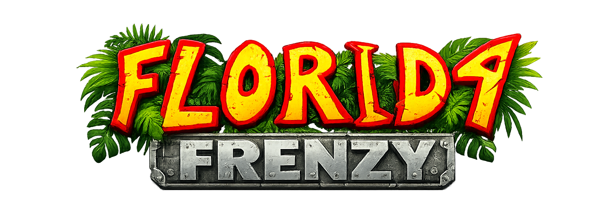
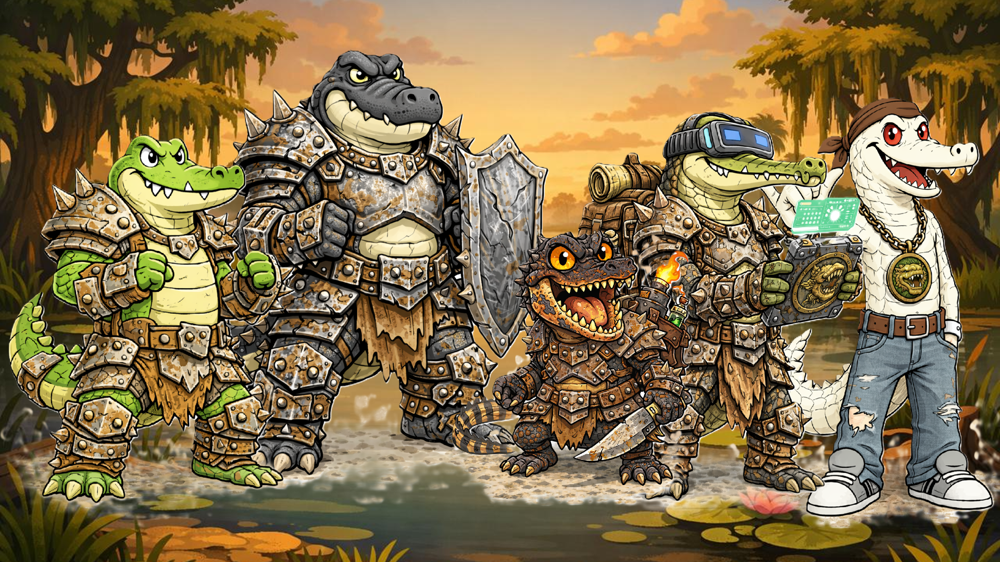

# 

## _Game Design Document_

### **Propuesta completa del juego FLORIDA FRENZY**
#### ***Equipo 7***:
- Yael Ordaz – A01786776
- J. Manuel Montero - A01660761
- Santiago Hernández – A01787550

---
##
## _Index_

1. [Index](#index)
2. [Game Design](#game-design)
    1. [Summary](#summary)
    2. [Gameplay](#gameplay)
    3. [Mindset](#mindset)
3. [Technical](#technical)
    1. [Screens](#screens)
    2. [Controls](#controls)
    3. [Mechanics](#mechanics)
4. [Level Design](#level-design)
    1. [Themes](#themes)
        1. Ambience
        2. Objects
            1. Ambient
            2. Interactive
        3. Challenges
    2. [Game Flow](#game-flow)
5. [Development](#development)
    1. [Abstract Classes](#abstract-classes--components)
    2. [Derived Classes](#derived-classes--component-compositions)
6. [Graphics](#graphics)
    1. [Style Attributes](#style-attributes)
    2. [Graphics Needed](#graphics-needed)
7. [Sounds/Music](#soundsmusic)
    1. [Style Attributes](#style-attributes-1)
    2. [Sounds Needed](#sounds-needed)
    3. [Music Needed](#music-needed)
8. [Schedule](#schedule)

---

## _Game Design_

---

### **Summary**

Florida Frenzy es un juego roguelite en 2D, que involucra mecánicas de un TCG y un 'platformer game'. Asumes el rol de alguno de los miembros del Crock Clan, y te enfrentas contra las amenazas del pantano de Florida. Colecciona cartas, gana experiencia, participa en duelos que incrementarán en dificultad conforme progreses en el juego. Este también resulta más entretenido, debido a cómo integra mecánicas 'familiares' al jugador, creando una experiencia dinámica. Combinando elementos del juego "UNO", atributos del juego clásico de cartas Pokémon, y el disfrute de una jugabilidad rápida por parte de su 'platformer'. Consistiendo en 'runs' cortas, pero intensas, que generan un juego dinámico y divertido. El elemento diferenciador del juego radica en la integración de dos sistemas paralelos. Por su parte el combate basado en coincidencia de cartas por elemento o número. Asi como un sistema dual de energía (Energía Elemental e Instinto) que introduce decisiones tácticas adicionales más allá de simplemente “hacer match”.

### **Gameplay**

El objetivo principal es sobrevivir a una serie de &quot;runs&quot; (partidas reiniciables) en las cuales avanzarás a través de niveles en un mapa 2D. Cada 'run' dependerá de tu agilidad para superar los obstaculos presentes durante el platformer, asi como de el nivel de dificultad que implique el duelo de cartas que se te presente durante tu trayectoria.

Con un aproximado de 3 niveles/mapas dentro del pantano(mas un breve tutorial), el jugador podrá disfrutar del juego y su versatilidad. Encontrandose con la parte 'platformer' del juego, donde el jugador evade enemigos de menor nivel. Debido a que los mapas serán diseñados para generar ciertos elementos de manera distinta, y por consecuencia, aleatoria. Cada run se compone de tres zonas principales:
- 3 combates estándar
- 1 evento especial (recompensa)
- 1 jefe de la zona

El jugador se enfrentará a diversas facciones enemigas del pantano (mapaches, ratas y osos), así como a los jefes de zona, los cuales deben de ser derrotados para validar el exito de la run en curso. Cada tipo de enemigo obliga a adaptar estrategia de cartas. Al entrar en contacto con un enemigo en específico, iniciará el duelo de cartas. Dependerá de la destreza y el inventario (mazo) del jugador, con tal de que este resulte ganador contra alguno de los rivales que se encontrará en su camino. 

Conforme el jugador progrese, la dificultad escalará, y sus oponentes aplicarán jugadas más complicadas. De igual manera, tendrá acceso a objetos desbloqueables, de acuerdo a su progreso mismo. Siendo que sus victorias le darán acceso a un pequeño catálogo de opciones para mejorar sus estadísticas, o su propio mazo. Cuando pierde un combate, el jugador es regresado al primer nivel. Dada la naturaleza Roguelite del juego, conservará su progreso "global" mediante su experiencia adquirida (Swamp XP). Con la cual podrá mejorara su 'Clan Credit'; lo que le dará acceso a los desbloqueables. Como la carta estrella, "Hielo".

La fase de exploración dentro del platformer es bastante sencilla. El jugador debe evadir cierta cantidad de obstáculos y enemigos menores hasta entrar en la fase del duelo de cartas. Su mecánica principal está basada en jugar cartas que cuenten con algún atributo idéntico a la carta en juego, al estilo de UNO.

Siendo más específicos:

- Mano inicial: 5 cartas
- Robo por turno: 1 carta
- Vida base del jugador: 100 HP
- Condición de victoria: reducir la vida del enemigo a 0
- Condición de derrota: perder todos los HP

Esto dejaría el 'loop' del juego así:

Start Run → Exploración Platformer → Contacto con enemigo → Duelo de cartas → Recompensa → Avance (x3) → Boss Final → Fin de run

Existen cinco elementos con identidad estratégica:

- **Agua**: defensa y reducción de daño.
- **Pantano**: veneno y daño progresivo.
- **Fuego**: alto daño directo.
- **Arena**: reducción del daño enemigo.
- **Hielo**: comodín; puede congelar por 2 turnos, permitir jugar 2 cartas por 2 turnos, o provocar pérdida de 2 turnos enemigos.

También existen dos recursos:

- **Energía Elemental**: se genera al jugar cartas del mismo elemento consecutivamente. Se utiliza para activar habilidades especiales.
- **Energía Instinto**: se genera dependiendo del valor numérico de la carta jugada. Permite recargar habilidades únicas del personaje.

Ambos recursos tienen un límite máximo y se reinician parcialmente al finalizar un combate.

Al finalizar una run, ya sea por victoria o derrota, el jugador obtiene **Swamp XP**. Este recurso le permite escoger entre:

- Desbloquear nuevas cartas
- Mejorar estadísticas base
- Obtener acceso a cartas raras

Esto constituye el sistema de progreso permanente del juego.

### **Mindset**

El objetivo es mezclar un la jugabilidad "nostálgica" con los elementos 'punk' y caricaturescos de los personajes. Provocando una sensación de estrategia caótica, con identidad punk-industrial del pantano. El jugador debe sentirse como un miembro mas del clan que improvisa constantemente. La experiencia está diseñada bajo la idea de que sea fácil de entender, pero difícil de dominar.

El caos visual contrasta con la claridad de información de la interfaz, fomentando análisis cr´tico y lógico en medio de la tensión.

## _Technical_

---

### **Screens**
1. Title Screen
Contiene el logo del juego, una imagen del pantano en el fondo, y las siguientes opciones (en descendente):
    - Start
    - Multiplayer
    - Store
    - Settings
    1. Options (dentro de Settings)
        - Modular el volúmen (música, efectos, y general/ambos)
        - Ajuste de pantalla (tickbox); se adapta al browser del jugador
2. Level Select
    - No habría en este caso, dado que las 'runs' son continuas.
3. Game
    - Modo Exploración
        Movimiento lateral, con elementos clásicos de un 'platformer'; el jugador se desplaza por el mapa enfrentando enemigos con mecánicas de ataque sencillas, hasta entrar en contacto con aquel enemigo que inicia un duelo de cartas.
    - Duelo de Cartas
        Muestra el tablero, el mazo con las cartas del jugador, así como las estadísticas de este mismo y las de su oponente.
        1. Inventory:
        Permite revisar el mazo con las cartas disponibles, alguna mejora, y las estadísticas del juegador.
        2. Assesment / Next Level: 
        El jugador es felicitado por su victoria, y se le ofrecen 5 cartas nuevas desbloqueables; este solo podrá escoger una para su colección.
4. End Credits
    - Una vez el boss final es derrotado (Pythra), el jugador será felicitado por Klancy, quien le enseñó al jugador cómo jugar desde un inicio. Finalmente rombe la cuarta pared, y muestra los nombres de los creadores del juego.

### **Controls**

El juego requerirá del uso de teclado y mouse para ambos modos (principalmente para la exploración).

**Controles de Movimiento**
1. W & Space Bar <-- Saltar
2. D <-- Mover Derecha
3. A <-- Mover Izquierda
4. E <-- Interactuar
5. I <-- Acceso al inventario (abrir y cerrar)
6. ESC <-- Pausa
7. Mouse Movement <-- Apuntar (Exploración) e interactuar con el tablero de cartas
8. Click Izquierdo <-- Disparar (Exploración) y seleccionar/jugar una carta (doble click para confirmar una selección)
9. Click Derecho <-- Descartar una carta

### **Mechanics**

El duelo de cartas consiste en diferentes reglas y atributos que definen el flujo del enfrentamiento. Ya que esta directamente inspirado en el juego 'UNO', las mecánicas se asemejan a las de este juego de mesa. Con algunos elementos innovadores y estratégicos, que hacen de una jugada algo más entretenido.

#### **Valid Plays**

Una carta se considera válida si coincide con la carta en mesa en al menos uno de estos dos atributos:

- Elemento
- Valor numérico

**Ejemplo 1:**  
Carta en mesa: Fuego 5  
Carta del jugador: Fuego 8  
Resultado: válida por coincidencia de elemento.

**Ejemplo 2:**  
Carta en mesa: Arena 4  
Carta del jugador: Agua 4  
Resultado: válida por coincidencia de número.

**Ejemplo 3:**  
Carta en mesa: Pantano 7  
Carta del jugador: Fuego 3  
Resultado: inválida.

**Ejemplo 4:**
Carta en mesa: Agua 4
Carta del jugador: Hielo (Ice Overdrive)
Resultado: válida, al ser un comodin, el jugador puede utilizar esta carta legalmente

#### **No Valid Move Rule**

Si un jugador no tiene una carta válida, puede elegir una de dos acciones:

- Descartar una carta de su mano.
- Recibir daño leve por exposición y conservar la mano actual.

Esto obliga al jugador a decidir entre perder recursos o perder vida.

#### **Card Structure**

Cada carta contiene:

- Elemento
- Valor numérico
- Tipo
- Efecto principal
- Rareza
- Costo de energía (si aplica)

#### **Card Types**

Las cartas del juego se dividen en cuatro tipos principales:

- **Ataque**: infligen daño directo al enemigo.
- **Defensa**: reducen daño recibido o aumentan resistencia temporal (mientras que generan un daño leve, en comparación a la reducción propia).
- **Estado**: aplican efectos persistentes como quemadura (daño extra), envenenamiento (daño lento dependiente de la vida del oponente), arena movediza (cartas con cierto número o color se bloquean temporalmente), y congelamiento.
- **Especiales**: unicamente la carta de Hielo (esta solo contaría con un rango numérico del 1-4, y solo aplicaría para Ice Stun y Ice Jam)

#### **Initial Card Set Examples**

| Carta | Elemento | Número | Tipo | Efecto |
|------|----------|------:|------|--------|
| Splash Guard | Agua | 5 | Defensa | Reduce 7 de daño recibido este turno, inflige 2 de daño |
| Tidal Push | Agua | 6 | Ataque | Inflige 12 de daño |
| Venom Drip | Pantano | 2 | Estado | Aplica veneno por 2 turnos |
| Mire Trap | Pantano | 6 | Ataque | Inflinge 6 de daño |
| Burn Bite | Fuego | 4 | Ataque y Estado | Inflige 4 de daño directo y aplica 2 de daño por quemadura |
| Wild Flare | Fuego | 11 | Especial | Inflige 11 de daño alto pero consume Energía Instinto (66%) |
| Quick Sand | Arena | 5 | Defensa y Estado | Reduce 50% de daño del siguiente ataque enemigo |
| Dust Jam | Arena | 8 | Ataque | Inflinge 8 de daño |
| Ice Overdrive | Hielo | Null | Especial | Funciona como comodín de elemento |
| Ice Stun | Hielo | 2 | Estado | Congela al enemigo por 2 turnos |
| Ice Jam | Hielo | 4 | Estado | El jugador en turno puede jugar 2 cartas por 4 turnos |

#### **Enemies**

Los enemigos también utilizan el sistema de cartas durante los duelos. Dependiendo del nivel de dificultad o del tipo de enemigo, la inteligencia artificial puede tomar decisiones diferentes al momento de jugar una carta. Tenemos contempladas tres modalidaes:
*Easy AI*
    Selecciona una carta válida de forma aleatoria, entre las opciones disponibles.

*Medium AI*
    Le da prioridad a cartas que produzcan coincidencias dobles (elemento y número), con el objetivo de generar energía más rápido.

*Hard AI*
    Evalúa las cartas disponibles, dandole prioridad a jugadas que generen la mayor cantidad de energía, activen habilidades y mantengan presión ofensiva sobre el jugador

La idea es que por dos runs, la dificultad se mantenga sencilla (complementando con el hecho de que el jugador esta cursando el tutorial, y es nuevo en el juego). Subiría a dificultad media por otras tres, y de ahí en adelante se mantendría en la última dificultad. 

El combate se desarrolla por turnos alternados entre el jugador y el enemigo. Durante un turno, cada participante puede jugar una carta válida desde su mano, o realizar una acción alternativa (como descartar una carta).

## _Level Design_

---

### **Themes (maps)**

1. Pantano (Swamp)
    1. Mood
        1. Turbulento, sucio, tierroso, hogareño
    2. Objects
        1. _Ambient_
            1. Árboles
            2. Vegetación de la zona
            3. Riachuelo del pantano
            4. Superficie a la orilla del riachuelo
        2. _Interactive_
            1. Ratas (primer mapa)
            2. Inicio de duelo (por contacto)
2. Basurero (garbage dump)
    1. Mood
        1. Sucio, revuelto, incomodo
    2. Objects
        1. _Ambient_
            1. Elementos de armaduras
            2. Camiones
        2. _Interactive_
            1. Mapaches (segundo mapa)
            2. Inicio de duelo (por contacto)
3. Suburbios (suburbs)
    1. Mood
        1. Peligroso, remoto
    2. Objects
        1. _Ambient_
            1. Casas, departamentos
            2. Calles
            3. Vehículos
        2. _Interactive_
            1. Osos (tercer mapa)
            2. Inicio de duelo (por contacto)
4. El Desagüe (The Sewers)
    1. Mood
        1. Peligroso, sucio, conflictuado, desconocido
    2. Objects
        1. _Ambient_
            1. Tuberias
            2. Plataformas
            3. Escaleras
        2. _Interactive_
            1. Osos (tercer mapa)
            2. Inicio de duelo (por contacto)
            3. Pythor - Boss Final (Python bivittatus)

### **Game Flow**

1. Klancy introduce al jugador al mundo de Florida Frenzy.
2. Le enseña cómo funciona el sistema de cartas y la fase de platformer.
3. El jugador inicia una run.
4. Explora una zona del mapa.
5. Entra en contacto con un enemigo.
6. Se activa un duelo de cartas.
7. Si gana, recibe una recompensa o mejora para el mazo.
8. Avanza a la siguiente zona.
9. El ciclo se repite hasta llegar al jefe final.
10. Al derrotar al jefe final, se activa el cierre de la run y la secuencia final.

---
## _Development_

---

### **Abstract Classes / Components**

1. BaseEntity
    1. BasePlayer
    2. BaseEnemy
    3. BaseNPC
2. BaseCard
3. BaseDeck
4. BaseBattle
5. BaseZone
6. BaseInteractable
7. BaseObstacle

_(example)_

### **Derived Classes / Component Compositions**

1. BasePlayer
    1. CrocClanCharacter
        1. CharacterChristian
        2. CharacterGustav
        3. CharacterGavin
        4. CharacterEddy

2. BaseEnemy
    1. EnemyRizzy
    2. EnemyRabyz
    3. EnemyBoldear
    4. BossPythra
    5. NPCRat
    6. NPCRaccoon
    7. NPCBear

3. BaseCard
    1. CardWater
    2. CardFire
    3. CardSwamp
    4. CardSand
    5. CardIce
        1. IceStun
        2. IceOverdrive
        3. IceJam

4. BaseZone
    1. ZoneSwamp
    2. ZoneGarbageDump
    3. ZoneSuburbs
    4. ZoneSewers

5. BaseInteractable
    1. InteractableEnemyTrigger
    2. InteractableRewardChest
    3. InteractableEventSpot

6. BaseObstacle
    1. ObstacleSwampWater
    2. ObstacleGarbagePile
    3. ObstacleBrokenCar

## _Graphics_

---

### **Style Attributes**

Decidimos irnos por un estilo caricaturesco, con elementos relativamente realistas, para los personajes. Adecuando sus alreadedores (escenarios) con esta misma idea. Aunque, durante el proceso del desarrollo, la IA utilizada para generar a los personajes base (ChatGPT), realizó a los enemigos ligeramente más realistas y con más detalles. La idea es que los cocodrilos tengan este aspecto de guerreros de un clan, que recicla lo que encuentra en los basureros (y tristemente en los ríos) de toda el área pantanosa de Florida. Aprendieron "el arte antiguo" de Florida Frenzy, por lo que el aspecto de las cartas va por una impresión de "antigüedades" o elementos legendarios. Los enemigos son la consecuencia de experimentos bio-cibernéticos que se dieron a la fuga. Mientras que estos lograron adquirir su intligencia por medio de su interconección con computadoras al cerebro, nuestro protagonistas la desarrollaron por los contaminantes y radiación que se encuentra en las aguas del pantano.

Dejando así un contraste visual entre "buenos vs. malos", dandole una perspectiva clara al jugador. Los poderes/elementos de las cartas están hechos para ser lo más simples, entendibles y llamativas posibles. 

Los personajes, así como otros sprites y diseños que se utilizarán en el juego, se encuentran en las siguientes carpetas:

| Category | Location |
|----------|----------|
| Logos | [logos](../client/src/assets/logos/) |
| Iconos | [iconos](../client/public/) |
| Sprites | [sprites](../client/src/assets/sprites/) |
| Fondos | [backgrounds](../client/src/assets/backgrounds/) |
| Personajes (WIP) | [characters](../client/src/assets/characters/) |
| Sprites y diseños desechados | [scrapped_assets](../Videojuego/scrapped_assets/) |

### **Graphics Needed**

1. Characters
    1. Human-like
        1. Goblin (idle, walking, throwing)
        2. Guard (idle, walking, stabbing)
        3. Prisoner (walking, running)
    2. Other
        1. Wolf (idle, walking, running)
        2. Giant Rat (idle, scurrying)
2. Blocks
    1. Dirt
    2. Dirt/Grass
    3. Stone Block
    4. Stone Bricks
    5. Tiled Floor
    6. Weathered Stone Block
    7. Weathered Stone Bricks
3. Ambient
    1. Tall Grass
    2. Rodent (idle, scurrying)
    3. Torch
    4. Armored Suit
    5. Chains (matching Weathered Stone Bricks)
    6. Blood stains (matching Weathered Stone Bricks)
4. Other
    1. Chest
    2. Door (matching Stone Bricks)
    3. Gate
    4. Button (matching Weathered Stone Bricks)

_(example)_

## _Sounds/Music_

---

### **Style Attributes**

Again, consistency is key. Define that consistency here. What kind of instruments do you want to use in your music? Any particular tempo, key? Influences, genre? Mood?

Stylistically, what kind of sound effects are you looking for? Do you want to exaggerate actions with lengthy, cartoony sounds (e.g. mario&#39;s jump), or use just enough to let the player know something happened (e.g. mega man&#39;s landing)? Going for realism? You can use the music style as a bit of a reference too.

 Remember, auditory feedback should stand out from the music and other sound effects so the player hears it well. Volume, panning, and frequency/pitch are all important aspects to consider in both music _and_ sounds - so plan accordingly!

### **Sounds Needed**

1. Effects
    1. Soft Footsteps (dirt floor)
    2. Sharper Footsteps (stone floor)
    3. Soft Landing (low vertical velocity)
    4. Hard Landing (high vertical velocity)
    5. Glass Breaking
    6. Chest Opening
    7. Door Opening
2. Feedback
    1. Relieved &quot;Ahhhh!&quot; (health)
    2. Shocked &quot;Ooomph!&quot; (attacked)
    3. Happy chime (extra life)
    4. Sad chime (died)

_(example)_

### **Music Needed**

1. Slow-paced, nerve-racking &quot;forest&quot; track
2. Exciting &quot;castle&quot; track
3. Creepy, slow &quot;dungeon&quot; track
4. Happy ending credits track
5. Rick Astley&#39;s hit #1 single &quot;Never Gonna Give You Up&quot;

_(example)_

## _Schedule_

---

_(define the main activities and the expected dates when they should be finished. This is only a reference, and can change as the project is developed)_

1. develop base classes
    1. base entity
        1. base player
        2. base enemy
        3. base block
  2. base app state
        1. game world
        2. menu world
2. develop player and basic block classes
    1. physics / collisions
3. find some smooth controls/physics
4. develop other derived classes
    1. blocks
        1. moving
        2. falling
        3. breaking
        4. cloud
    2. enemies
        1. soldier
        2. rat
        3. etc.
5. design levels
    1. introduce motion/jumping
    2. introduce throwing
    3. mind the pacing, let the player play between lessons
6. design sounds
7. design music

_(example)_
